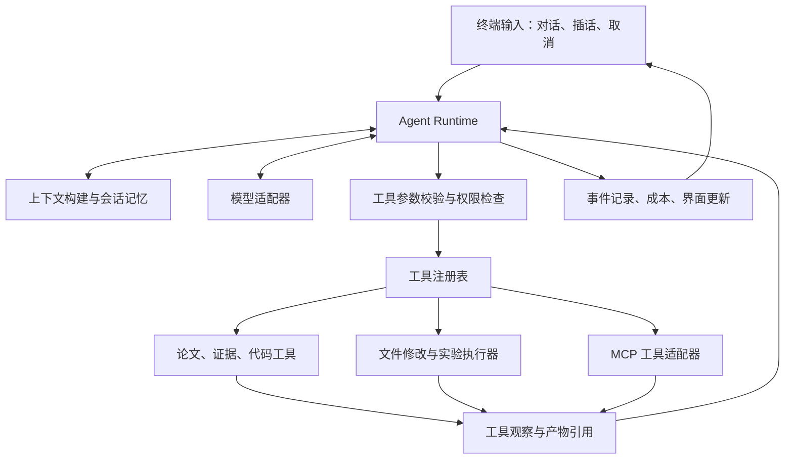

# ResearchCLI：交互式科研 Agent 项目规格

> v0.2 已迁移到 Pi CLI + 科研扩展 + Python MCP。本文保留原型设计与验收历史；当前实现、安装和验证以 README、docs/architecture.md、docs/validation.md 为准。

设计日期：2026-09-29。当前已有可运行 v0.1 开发版，实际命令、验证结果和限制以 README 与开发任务清单为准。本文件保留设计目标，以下示意不等于全部实现。ResearchCLI / research-terminal 尚未发布 PyPI；GitHub 仓库入口见 README。

**1．产品定位与已确定需求**

一个运行在终端里的科研搭档：用户用自然语言持续讨论研究方向，agent 自主选择检索、阅读、代码、文件和实验工具，随观察结果调整行动；用户可以插话、打断、补充材料和改变目标。

已确定的要求：交互体验参考 Claude Code／Codex CLI；以论文调研、开源代码理解与复用、问题挖掘、方法改进及实验验证为核心能力；面向面试展示和 GitHub 开源；覆盖有实际落点的 Agent 技术知识；科研阶段不编码成必须依次经过的 workflow。

研究者描述的“调研 → 找不足 → 改进 → 验证”用于理解业务和设计工具。用户可以从任意位置开始：先读本地仓库、直接分析失败日志、追问论文中的假设，或者修改已有实验。agent 每轮重新依据当前目标、用户约束和工具观察决定下一步。

可借鉴的交互与机制：Claude Code 官方将自身描述为围绕模型的工具与上下文运行层，支持用户在执行中调整方向；Codex CLI 提供交互终端、会话恢复、工具扩展等能力。本项目借鉴这些机制，具体实现由下面的可验收范围约束。[Claude Code 官方机制](https://code.claude.com/docs/en/how-claude-code-works)、[Codex CLI 官方说明](https://learn.chatgpt.com/docs/codex/cli)

**2．目标使用体验**

用户启动 `research` 后留在同一个会话中。自然语言是主入口，斜杠命令只管理会话、上下文、工具和执行状态。以下是虚构的交互示意，不是已完成运行的记录。

```text
$ research

ResearchCLI  ·  workspace: ./my-research  ·  session: s_demo

you > 调研近三年检索重排的论文，优先找作者公开代码的工作。
agent  正在检索论文与作者提供的代码链接……
tool   search_papers(...) → 候选文献
tool   inspect_repository(...) → 代码来源、许可证、运行入口
agent  给出候选对比，并标记未找到代码及仅有摘要的记录。

you > 先看第二篇。论文里的重排分数和实现是否一致？
tool   read_paper(...) / search_code(...) / read_file(...)
agent  对照论文原文与具体代码位置，列出一致项和待确认项。

you > 我怀疑它在长查询上效果不好，先设计验证实验。
agent  提出分组方式、基线、评价指标及可能的混杂因素。

you > 用现成的小数据集跑一下，只允许 CPU，最多十分钟。
agent  展示将执行的命令、环境、数据与资源限制。
tool   run_experiment(...) → job_demo

you > 先停一下，不改模型，先检查是不是输入被截断了。
agent  停止后续修改，检查配置、token 长度和失败样例。

you > /jobs
you > /evidence
you > /diff
you > /exit

$ research --resume s_demo
```

CLI v0.1 应提供多行输入、中文、历史记录、流式输出、工具调用摘要、可展开结果、打断当前轮、退出后恢复。后续加入执行中消息队列和任务通知。

建议命令：`/help`、`/new`、`/sessions`、`/resume`、`/context`、`/compact`、`/model`、`/tools`、`/skills`、`/jobs`、`/evidence`、`/diff`、`/permissions`、`/cost`、`/exit`。分版本加入，不要求首版全部实现。`@路径` 用于显式引用本地资料。另保留 `research exec ... --json` 作为自动测试和脚本接入入口，与交互界面共用内核。

**3．核心架构：可交互的 Agent 运行时**



业务层不设置 literature、hypothesis、experiment 之类的强制阶段迁移。运行时只管理通用执行状态，例如等待输入、模型生成、调用工具、等待批准、被打断和结束。

建议首版自己实现一个范围有限的 agent loop，使用供应商官方 SDK 调用模型。这样工具调度、上下文选择、取消、恢复等代码清晰可读，适合面试讲解。可借用库完成模型协议、终端渲染、数据库和 MCP，不需要自制通用 Agent 框架。

下面是机制说明，不是可直接执行的代码：

```text
收到用户输入或恢复会话
  → 合并最新用户约束，读取相关上下文
  → 请求模型返回文本或结构化工具调用
  → 若有工具调用：校验参数、执行策略检查、运行工具
  → 持久化工具结果及产物引用，更新终端
  → 检查插话、取消、预算和循环上限
  → 将观察结果提供给模型，决定继续行动或回复用户
```

计划可以是 agent 动态维护的待办，允许增删改和被用户覆盖。技能提供方法指导，执行顺序由当轮任务决定。程序强制的内容是参数、权限、资源和状态一致性。

**4．首版科研工具边界**

| 能力 | 工具及产物设计 | 实现时的关键判断 |
|---|---|---|
| 论文发现 | search_papers、get_paper_metadata | 研究主题、时间范围、来源和检索日期可回查 |
| 代码关联 | find_code_links、inspect_repository | 区分作者提供、独立复现、相关实现；未知关系明确标记 |
| 论文阅读 | read_paper、search_paper、extract_evidence | 保留页码／章节／图表位置，区分原文、解释和推测 |
| 仓库理解 | list_files、search_code、read_file、git_status | 从入口、配置、训练与评价代码理解实现，不默认加载整个仓库 |
| 文献与代码对照 | 保存 claim、evidence、repo_commit、file_location 关联 | “有 GitHub 链接”不能自动推断“可复现”或“可再分发” |
| 修改代码 | apply_patch、git_diff | 限定工作目录，保留用户已有修改，补丁关联当前文件版本 |
| 运行与检查 | run_command、run_experiment、job_status、cancel_job | 分离短命令与长实验，保存 PID／执行 ID、输出和退出状态 |
| 结果比较 | read_metrics、compare_runs、save_artifact | 指标关联数据划分、代码版本、参数和运行环境 |
| 项目记忆 | read_project_note、update_project_note | 用户约束、已核验事实、未验证假设和临时笔记分开保存 |

首个公开版本支持一个文献发现源、一种主要 PDF 解析路径和 GitHub 公共仓库检查。架构留扩展口，数据源数量按需求增加。受限全文、下载失败和 API 限流作为可处理的工具结果返回。

复现状态细分为：已关联仓库、环境可启动、数据可取得、小样本运行通过、指定结果重现、完整论文复现。每个标签要求不同证据，面试演示中的 smoke run 不能标为完整复现。

**5．热门知识点如何落到功能上**

| 技术主题 | 项目中的具体实现 | 可以展示的证据 | 优先级 |
|---|---|---|---|
| Agent loop / ReAct 思路 | 模型根据工具观察反复行动，动态修正计划 | 同一任务在不同观察下选择不同动作 | P0 |
| Function calling / structured output | 工具注册、JSON Schema、参数校验、统一错误 | 错误参数被阻止，工具失败后可选择替代方案 | P0 |
| 上下文工程 | 按需读文件、token 预算、工具结果落盘、摘要压缩 | 长会话不丢关键用户约束和证据 ID | P0 |
| 会话与长期记忆 | 会话记录、项目事实、研究假设分别持久化 | 关闭终端后继续，跨会话取回必要项目事实 | P0 |
| Agentic RAG | 模型可改写查询、多次检索、检查证据不足并补查 | 相比单次检索，固定问题集中的有依据回答变化 | P1 |
| Hybrid retrieval / reranking | 关键词与向量召回、结果融合和重排 | BM25、dense、hybrid、加重排的消融对比 | P1 |
| Skills / progressive disclosure | 先展示技能简介，被选中再加载完整说明 | 不同研究任务只加载需要的能力说明 | P1 |
| MCP | 把外部工具发现与调用适配进同一个注册表 | 接入一个真实 MCP 服务，权限和日志仍统一 | P1 |
| 异步执行与用户介入 | 模型流式生成、工具事件、任务取消、长实验后台运行 | 演示中断、改目标、查看实验与恢复会话 | P0–P1 |
| 执行隔离与变更管理 | 工具策略、工作目录隔离、资源限制、diff | 越界操作被执行层阻止，代码改动可审阅 | P0–P1 |
| 可观测性与 Evals | 事件 trace、评测样例、预算、回归和消融实验 | 可重跑评测，报告质量、延迟和成本 | P0–P1 |
| Jev / 模型路由 | 可替换的语义判断适配器 | 对比规则、普通 LLM 与 Jev 的取舍 | P2，加分项 |
| 多 agent | 主 agent 按需派出有范围的检索／审查任务 | 对照单 agent 的增益与额外开销 | P2，加分项 |

表中的优先级是建设建议，“热门”不表示招聘市场统计排名。MCP 的核心价值是统一外部工具连接，不能替代检索、记忆、权限或执行器。[MCP 官方架构](https://modelcontextprotocol.io/docs/2026-07-28/learn/architecture)

多 agent 采用按需委派，首版保留一个主 agent。各执行者拥有独立上下文和限定的任务边界，默认只读；并行改代码需要隔离目录或分支，以及明确的合并者。是否增加多 agent 由评测决定。

**6．Jev 的准确定位**

本轮查到的 Jev 是 TypeSafe AI 的 System One 模型。官方接口接收 state 和有类型的问题，返回 Choice、Score、Noul 等结构化结果；它适合判断与排序，不负责主对话中的长文本和代码生成。[官方文档](https://docs.typesafe.ai/introduction)、[官方 Python SDK](https://github.com/typesafe-ai/typesafe-sdk-python)

建议将 Jev 作为可选的 `JudgmentProvider`：

- 给候选论文的主题相关性评分，供主 agent 选择下一篇阅读。
- 对候选证据片段进行初步重排，减少主模型需要读取的材料。
- 对范围清晰的请求做分类，辅助选择工具集合或模型。

先实现规则或普通模型基线，再加入 Jev。缺少 key 或服务不可用时，主 agent 仍可正常工作；记录实际使用的提供方，不能静默把备用结果标为 Jev。

将“格式正确”“概率校准”“科研判断正确”分别评测。返回有类型的数据不代表理解一定正确；文献创新性、完整复现和科学结论不交给单次 Jev 分数最终裁决，执行权限也由确定性规则控制。

加分实验可以使用同一标注集比较规则、普通 LLM、Jev：测论文相关性准确率／召回率、排序 nDCG、P50/P95 延迟、费用和调用失败率；若采用概率阈值，再测 Brier score 或校准曲线。具体收益在测量后报告，不采用厂商速度倍率作为本项目成绩。

**7．上下文、状态与实验管理**

| 记录层 | 保存内容 | 加载策略 |
|---|---|---|
| 当前轮 | 最新用户意图、约束、必要工具调用与观察 | 高优先级；用户最新约束覆盖旧计划 |
| 会话 | 历史消息、工具事件、摘要、取消和批准记录 | 最近对话加摘要，原始事件可检索 |
| 项目 | 研究目标、已知事实、假设、证据及关键路径 | 按任务取用，有来源和更新时间 |
| 文献与仓库 | 解析结果、源文件、代码位置、commit | 检索和按需读取 |
| 实验 | 数据／代码／环境版本、参数、命令、指标和日志 | 按运行 ID 查询，长输出落盘 |

SQLite 保存结构化记录和事件，文件系统保存原始资料及大产物。向量索引用于检索内容，不作为唯一事实库。项目内 `.research/` 保存本地状态；数据库、密钥、受限全文和大数据默认不进入 Git。

上下文压缩必须保留用户约束、未完成工作、证据 ID、文件／代码版本和不确定性。工具的完整结果存档，上下文只放摘要与可重新读取的引用。技能和工具说明按需加载，避免每轮塞入整个能力目录。

运行事件至少包含：session_id、turn_id、tool_call_id、event_id、时间、工具参数摘要、结果引用、退出状态、耗时、模型用量以及错误类别。未知费用明确标记未知。事件用于调试和重放 UI，不承诺外部网络和模型行为可完全确定性重演。

恢复会话时，纯读取可以重新执行；修改文件、提交远程任务等动作必须检查此前是否已完成。批准应绑定具体工具、参数、目录及其指纹；参数变化后重新检查授权。实验进程是否能跨 CLI 退出存活取决于执行器，第一版需明确支持范围。

**8．建议技术栈与工程边界**

| 部分 | 建议选型 | 理由 |
|---|---|---|
| 语言与并发 | Python + asyncio | 方便接科研代码、数据工具与异步 I/O |
| 终端输入 | prompt_toolkit | 支持交互输入、多行、补全、历史和中文；界面可逐步增强。[官方文档](https://python-prompt-toolkit.readthedocs.io/en/master/) |
| 终端输出 | Rich | 用于文本、表格和差异展示，避免 UI 与业务绑定。[官方文档](https://rich.readthedocs.io/en/stable/introduction.html) |
| 启动参数 | argparse 或 Typer，择一 | 负责启动和非交互入口，交互过程由 REPL 管理 |
| 运行内核 | 小型自实现 agent loop | 对外提供事件流，便于终端、脚本和测试复用 |
| 模型接口 | 统一内部协议 + 首个官方 SDK 适配器 | 文本流、工具调用、用量与错误统一；第二个 provider 后续加入 |
| 类型与配置 | Pydantic + TOML | 工具参数和配置可校验 |
| 持久化 | SQLite + 文件产物库 | 单用户 CLI 便于安装、备份和调试 |
| 检索 | 首版全文／关键词；后续加入 embedding 和重排 | 先有可比较基线，再用评测证明复杂度的收益 |
| 外部工具 | MCP 官方 SDK 适配器 | 统一发现、调用、超时与权限记录 |
| 实验执行 | 受限容器执行器，后续接集群 | 限 CPU、内存、时长、文件与网络；明确进程生命周期 |
| 工程交付 | uv、pytest、静态检查、GitHub Actions | 可重复安装和自动验证 |

上述为拟采用的实现，不是本轮安装结果。Python subprocess 是进程启动机制，本身不构成沙箱；仅做路径字符串检查也不能替代隔离执行。容器配置、挂载、网络和资源限制必须单独验证。

建议目录：

```text
research-cli/
  src/research_cli/
    cli/          # 输入、快捷键、渲染、斜杠命令
    runtime/      # turn、工具调度、事件、取消、预算
    providers/    # 主模型与 Jev 等可选判断器
    context/      # 上下文组装、压缩、技能加载
    tools/        # 文件、文献、GitHub、执行与 MCP 适配
    research/     # 论文、证据、仓库与实验领域记录
    storage/      # SQLite 与文件产物
  skills/         # 原创或允许分发的科研技能
  tests/
  evals/
  examples/
  docs/
  .github/workflows/
  pyproject.toml
  README.md
  README.zh-CN.md
  LICENSE
```

**9．让面试演示可落地**

首个演示主题建议采用“检索与重排方法的研究和小规模验证”。它直接对应 Agent 应用岗位，可以用公开资料和较小算力运行。具体论文、仓库和数据集需在案例建设时核验许可证、资源需求和基线；本轮未完成该领域文献筛选。

建议准备两种明确区分的演示：

1. 在线交互：用户临时指定方向，agent 检索论文、检查关联代码，讨论一项不足，并按用户选择继续读代码或设计实验。
2. 可重复案例：固定公开语料、相关性标注、代码版本与小实验，比较基线和改进。现场可打断、改约束、查看证据、恢复会话；固定数据帮助复现结果，动作仍由 agent 根据用户输入选择。

离线 CI 使用假模型响应和本地工具样例，验证运行时行为；离线 UI 回放必须标明 replay，不能冒充实时推理。真实模型任务另跑端到端评测，记录模型版本、日期、配置和失败案例。

实验评价优先使用已有可核验指标，例如 Recall@k、nDCG、延迟、内存和费用。数据划分、指标与停止条件提前记录。小规模验证产生负结果也应展示；实验只支持其设置范围内的结论。

**10．GitHub 交付与面试讲解材料**

仓库发布版本需要包含：

- 简明 README、中文说明、安装与配置、终端录屏、完整案例和已知限制。
- 可安装 Python 包与 CLI 入口，依赖锁定、配置样例、缺少 key 的清晰提示。
- 核心 agent loop、工具协议、存储格式和设计决策文档。
- 自动化测试、CI、固定评测集及实际测得的基线／消融结果。
- 许可证、第三方依赖和示例资料来源；不把私有技能或第三方全文直接复制进公开仓库。
- 故障说明：网络不可用、模型限流、解析失败、实验取消、恢复冲突分别怎么处理。

README 中区分已实现、实验性、计划中的能力。简历中的完成率、成本降低和加速倍率必须来自可复跑实验；研究稿生成不作为“自主科学发现”的证明。

面试重点可以围绕：为什么使用动态工具循环；上下文如何选取与压缩；用户插话如何影响正在执行的任务；怎样避免恢复后重复修改；检索证据如何关联代码和实验；MCP 与普通函数调用的边界；Jev 是否在真实任务上有收益。

**11．验收标准**

| 场景 | 必须满足的行为 |
|---|---|
| 只要求解释本地代码 | 直接读文件与代码，不强制先检索论文 |
| 只要求调研 | 能检索和引用，不擅自启动计算实验 |
| 中途改变目标 | 最新约束生效，过时计划不会继续触发修改 |
| 工具报错或缺少全文 | 如实返回限制，允许替代方案，不虚构成功 |
| 长会话压缩 | 保留关键约束与证据引用，原始记录可恢复读取 |
| 退出后继续 | 恢复上下文与待办，不盲目重放有副作用的工具 |
| 论文对应仓库 | 显示关联依据、代码版本和实际检查到的复现条件 |
| 运行小实验 | 保存数据、代码、环境与指标，能重跑并解释差异 |
| Jev 未配置 | 核心对话和科研工具仍可用，提供方状态明确 |
| GitHub 干净安装 | 依据 README 安装成功，基础测试和演示样例可运行 |

后续开发以《CLI科研Agent开发任务.md》为准。首个里程碑是可交互、可调用本地工具、可打断和恢复的 CLI Agent 内核。
