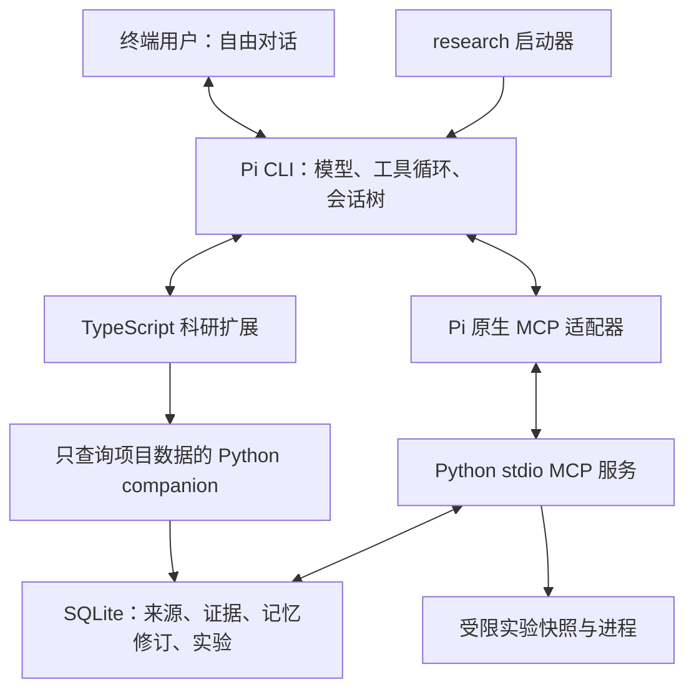

# v0.2 架构与面试讲解

## 架构

没有固定的文献→假设→实验状态机。Pi 根据当前对话选择工具，用户可停止或转向。`bin/research.mjs` 只检测环境、传配置并启动依赖中的 Pi CLI；没有复制或 fork 上游内核。`createMcpExtension` 使用 Pi 的公开 API。

## 状态与生命周期

- **对话**由 Pi 的 JSONL 会话树管理。Python 后端不重建 assistant/tool 消息历史。
- **科研项目记录**在 `.research/state.sqlite3`：来源、chunk、精确引文、结构化记忆、修订、实验和代码关联。数据库 schema 是增量创建，保留原型数据。
- **模型上下文**由扩展在每次请求前查询项目库，按字符预算注入。检索先保留有效约束，再选相关/近期记录，并附可回查的证据指针。注入是请求级的，不重复写入对话。
- **压缩**使用当前模型进行语义摘要，附结构化项目快照；后续请求仍读取最新记录。取消、空摘要、错误或截断时保留原历史。模型调用 usage 交回 Pi 计入会话统计。
- 同工作区只允许一个 MCP owner。先拿文件锁再恢复作业，避免第二个进程错误地把正在运行的作业标为未知。
- MCP 服务跨多次工具调用存活；服务关闭才清理其拥有的实验。切换/恢复/分支经过 Pi 生命周期，服务重建不会重放已有实验。
- 项目记忆跨分支共享，并记录来源会话。会话分支不是数据库时间旅行；变更需修订或退役，旧摘要不能覆盖当前数据库。

## 权限链

Pi `tool_call` → 本地静态工具分类/路径检查 → 用户审批或显式启动授权 → 参数绑定的短时 HMAC → MCP Schema 校验 → Python Registry → 工具。

授权包含工具名、原始参数、nonce 和有效期；由扩展注入，服务端验证并消费，模型生成或复用的 `_approval` 会被清除。审计不保存令牌。read-only 优先于自动批准。

复用 Pi 的 read/write/edit；路径限制覆盖 symlink 和写入 hardlink。递归搜索由已有受限文件工具提供。普通 shell/`!` 被关闭；实验从唯一执行工具进入。模型不能靠 MCP annotations 升级权限。扩展及 MCP 进程仍具有宿主权限，策略检查不是完整 OS 沙箱。

## 实验可靠性

`request_id` 绑定 argv、cwd 和超时；相同 ID/参数返回已保存的作业，不重复执行，不同参数拒绝。串行启动锁覆盖快照和进程建立，避免并发重试启动两个进程。任务完成后保留快照哈希、日志、退出码与状态。

仍不声称 exactly-once：在启动进程和保存结果之间崩溃可能留下未知状态。恢复时 `interrupted_unknown` 不等于未启动；需查实际状态。Docker 限制用于实验进程，不隔离 Pi 或 MCP 后端。local 是明确选择的宿主进程。

## 代码与知识点

| 位置 | 职责 | 面试讨论 |
|---|---|---|
| `bin/research.mjs` | 环境检查、安装、CLI 入口、子进程信号 | 依赖复用、分发与配置边界 |
| `pi/research.ts` | 原生 MCP、权限钩子、上下文、压缩与命令 | Agent lifecycle、上下文工程、Human-in-the-loop |
| `pi/policy.ts` | 路径/工具策略、审批签名 | 参数绑定、信任边界、防重放 |
| `memory.py` | 类型化科研记忆、引用检查、版本与检索 | 长期记忆、乐观并发、来源追踪 |
| `mcp_server.py` | Schema、协议错误、owner 生命周期 | 跨语言 MCP、取消/清理、审计 |
| `research.py` | Crossref/arXiv/GitHub、PDF、BM25、证据 | RAG、来源层级、引文与结论的区别 |
| `jobs.py` | 快照、进程组、超时、取消、去重 | async、幂等、故障恢复窗口 |
| `extensions.py` | embeddings/RRF、Jev | 检索质量、成本与消融 |
| `tests/pi` | 真实 Pi 协议集成 | mock 模型与 mock 运行时的区别 |
| `scripts/eval-memory.ts` | 同工具集合的记忆对照 | 机制验证与模型能力评估的区别 |

原 Python CLI 的 `cli.py/providers.py/runtime.py/context.py` 保留为 `research-legacy`，用于工程对照；主产品不调用这些运行时。历史架构在 [legacy-architecture.md](legacy-architecture.md)。

## 当前取舍

每次模型请求的项目查询使用短生命周期 Python companion，避免另开一个会恢复/拥有实验的 MCP 进程；这有进程启动开销，可用延迟测量判断是否值得改成常驻只读 IPC。

检索是小规模 SQLite 扫描；大项目需要倒排/向量索引。工具目前直接暴露，不开启 Codemode。先验证证据记忆的作用，再以测量结果决定工具路由、多 Agent 或远程执行是否值得加入。
