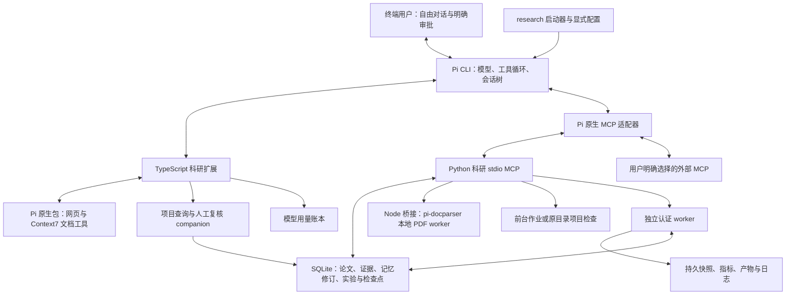

# Research CLI v0.4.0架构

## 交互与运行时

Pi 根据当前问题选择工具，用户可以转向、停止或接着任意记录讨论。工具不强制执行文献、假设、实验的固定顺序。启动器复用依赖中的 Pi CLI，扩展通过公开 `createMcpExtension` 接口连接 MCP，没有复制上游内核。

默认联网配置是 53 个科研 MCP 工具、3 个 Pi 文件工具和 6 个 Pi 原生包工具，共 62 个；配置 embeddings 后新增 2 个工具，外部工具按显式白名单暴露。PDF 提取复用 `pi-docparser` 原生 executor，保留科研导入、来源哈希、页码、chunks 和证据接口。[包复用与替换](pi-packages.md)

## 状态与信任

- Pi JSONL 会话树管理对话；Python 不重建主 CLI 的 assistant/tool 历史。
- `.research/state.sqlite3` 保存论文身份、材料与 chunks、引文、科研记忆、修订、复现方案、作业、审计和代码检查点。同一项目不同分支共享记录，Pi 会话分支不是数据库时间旅行。
- 每次模型请求用短生命周期 companion 查询项目库，先保留约束，再选择相关/近期记录与证据指针。它不创建第二个拥有作业的 MCP owner。
- 上下文压缩调用当前模型生成摘要并附项目记录。取消、空摘要、错误或截断保留原历史；之后仍查询当前数据库。普通生成和压缩分别记录数值 usage。
- 默认关闭环境中的扩展、技能、项目指令和其他 MCP 自动发现。显式 `--instructions`、`--skill`、`--mcp-config` 是用户选择的信任入口，工具数据不能打开这些入口。
- `research packages` 复用 Pi 公开包管理器，固定版本/commit，安装与启用分开。工具适配器统一本地权限、联网声明、取消信号和服务调用审计；用户包的非工具 hook 需要单独适配。默认 Pi 状态目录为 `~/.local/share/research-cli/pi-packages`，旧会话可明确选择恢复。

## 论文与证据

DOI 经过规范化；arXiv 版本保留独立来源记录，归入同一无版本号 `paper_id`。已存元数据的不同标识不会因标题相似合并。全文导入可以明确关联已有论文，arXiv 下载关联请求身份并保留版本限制说明。

论文地图按研究问题、方法、假设、数据、评价和限制保存条目。文献报告需要本论文的实际引文证据，推断和未知事项独立标注；保存使用乐观修订号并保留历史。比较返回缺失维度与协议差异提示，不自动认定指标可比。导出只使用已保存元数据，不补造引用字段。[论文地图](research-map.md)

记忆中的支持/反驳状态需要明确判断条件，实验判断对应已校验指标，文献判断对应具体声明及引文关系。未审查、模型审查和人工确认分开记录。`/review-memory` 由用户查看具体修订并明确操作；人工确认接口不在模型 MCP 工具列表中，更新仍需要匹配修订号。工程检查与人工确认都不保证科学结论成立。

## 权限链

科研 MCP：Pi 工具事件 → 静态本地作用分类/路径检查 → 用户审批或显式授权 → 参数绑定的短时 HMAC → MCP Schema → Registry → 工具。

签名包含工具名、原始参数、nonce 与有效期，扩展清除模型提出的 `_approval`，服务验证后消费。审计不保留签名密钥和批准令牌，read-only 优先于自动批准。

外部 MCP 使用用户明确配置的工具名与 `read/write/execute/external` 分类白名单，远端 annotations 不是授权。未列出的工具默认隐藏；网络离线选项不连接这些服务。外部 MCP 与扩展仍拥有其进程权限，客户端策略不构成 OS 隔离。

Pi read/write/edit 经过工作区与私有路径检查；写入保护覆盖 symlink 和 hardlink。项目搜索限制扫描量与输出，正则调用受限 ripgrep；Python 符号检查不运行源码。检查点保存用户选定文件，回退前检查全部内容与当前哈希，检测冲突；它不是全项目事务或 Git 提交。

原生包工具使用精确本地白名单。所有包工具的 execute 经共享审批函数，避免同一次调用重复弹窗；联网工具在离线模式不注册。启动禁用 Pi 内置工具，由核心扩展注册文件工具，并通过私有启动回执确认核心初始化。加载失败时启动器停止 CLI。包代码具有宿主权限，适配器不构成 OS 隔离。

## 实验与任务

`run_experiment` 在受限快照中执行。可选 spec 声明数据输入、划分、评价协议、seed、参数、指标定义和输出路径。启动前输出文件必须不存在；完成后重新检查数据、有限数值及产物哈希。退出码为零只说明进程完成。

`compare_experiments` 复查产物，核对数据及协议等条件，区分基线与候选的重复运行，返回均值、标准差、配对差值和条件提示；不自动推断显著性、因果关系或假设成立。复现阶段还检查方案命令、所声明固定 commit 的源码文件及数据/协议对应，并按目标容差核对指标。源码覆盖与指标语义仍需审查。

`run_project_check` 在原项目目录执行明确批准的测试、构建或 lint，使用已准备依赖，并保留运行前快照。该命令可能修改原项目；其退出状态不是科研指标。

前台任务随 MCP owner 关闭取消。`detached` 任务由独立 worker 持有，通过私有本地 socket、随机挑战与 HMAC 确认 owner，再查询或取消其子进程；控制密钥不通过作业工具返回。SQLite 事务在启动前预留并发槽位，当前最多两项实验/检查，未知独立 owner 继续占用槽位。

`request_id` 绑定执行参数；同 ID 同参数返回已有任务，不同参数拒绝。恢复任务需要明确的父任务及输入快照哈希，只从已知结束任务的保存文件发起新运行，程序必须自行读取 checkpoint。新 spec 仍要求新指标路径，旧结果不能当作新测量。

进程启动与持久记录仍存在未知窗口，不承诺 exactly-once。恢复无法认证的 owner 时保留 `interrupted_unknown`，不按保存 PID 发信号，也不自动重放。Docker 支持 CPU/内存/PID 和可选 GPU 参数，GPU 尚未实机验证；local 明确属于未隔离宿主进程。[实验说明](experiments.md)

## 配置、用量与持久数据

模型 profile 描述上下文、输出、推理、输入类型和四类 token 价格；声明不等于端点兼容性验证。`doctor --check-api` 仅显式 GET `/models`，不会生成文本或验证工具调用。

提示级步数、时间、token 和费用限制约束模型循环。token/费用在完成响应后累计，包括压缩，是软预算；未知价格不视作零。主模型用量写入 `.research/usage.jsonl`，付费 embedding/Jev 使用单独审计，其他 MCP 账单可能不可见，不能将总账误称为完整费用上限。

数据库通过 `user_version` 识别兼容版本并迁移旧项目，保留原 ID 和历史。备份通过 SQLite backup API 包含已提交 WAL 数据，以及产物、任务文件和已有用量账本；恢复检查归档路径、哈希和支持的数据库结构，在暂存区完成迁移后再安装到无 `.research` 的目标工作区。它不包含 Pi 会话、API 配置或原项目全部文件。[项目数据](project-data.md)

## 模块

| 位置 | 职责 |
| --- | --- |
| `bin/research.mjs`、`bin/api-doctor.mjs`、`bin/model-profile.mjs` | CLI 入口、环境安装、明确 API 检查与模型 profile |
| `bin/packages.mjs`、`pi/packages.ts` | Pi 包安装/选择、原生工具适配与权限 |
| `bin/document-parser.mjs`、`document_parser.py` | Pi 原生 PDF executor、跨语言取消/超时与页码完整性 |
| `pi/research.ts`、`pi/policy.ts` | Pi 生命周期、审批、上下文、压缩和用户命令 |
| `pi/profiles.ts`、`pi/trust.ts`、`pi/usage.ts` | 外部 MCP、显式材料选择、主模型用量与预算 |
| `research.py`、`research_map.py` | 检索、来源、论文身份、比较、引用导出与复现记录 |
| `memory.py`、`memory_query.py` | 科研记忆、修订、引用/指标条件及人工复核 companion |
| `jobs.py`、`job_worker.py`、`experiments.py` | 执行、独立 owner、恢复、结构化产物及比较 |
| `project_tools.py` | 有界搜索、Python 符号、选定文件检查点与回退 |
| `storage.py`、`maintenance.py`、`usage.py` | 数据版本、迁移、归档恢复与用量汇总 |
| `mcp_server.py`、`extensions.py` | MCP Schema/审批/owner、embeddings 与 Jev |
| `tests/pi`、`scripts/eval-memory.ts`、`scripts/eval-research.ts` | 真实工具链的模拟模型测试及可重复评测入口 |

原 Python CLI 保留为 `research-legacy`，主入口不调用其模型运行时。[旧 CLI](legacy-cli.md)

目前检索使用小规模 SQLite 扫描；OCR、大型检索索引、Windows、SSH/集群远程作业和多 Agent 尚未支持。模拟模型评测证明机制接通，不能替代真实模型质量评测或公开论文复现。
