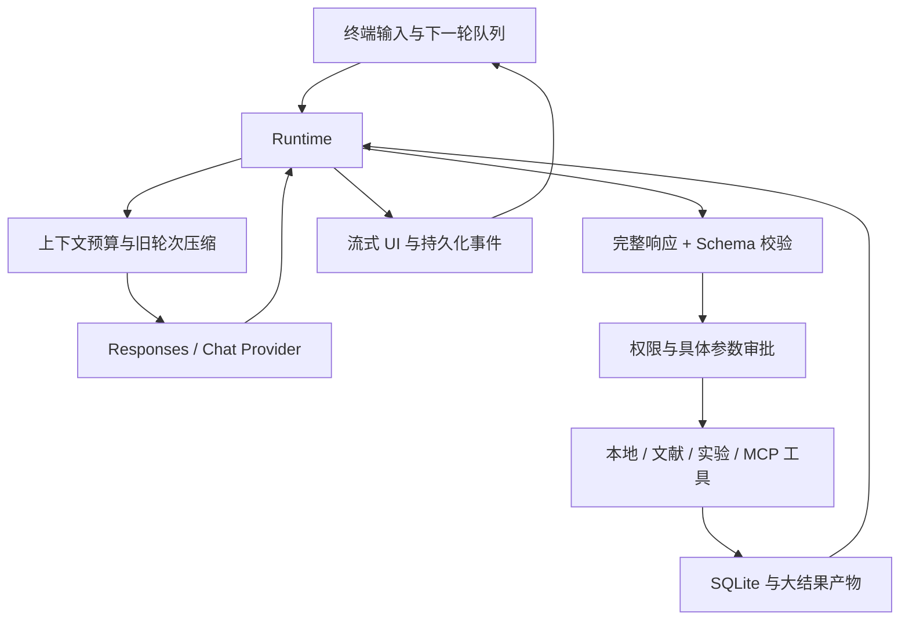

# v0.1 Python 原型架构（历史）

当前架构见 architecture.md。

# 运行时与面试讲解

程序围绕一个主 Agent 的交互循环组织。论文检索、代码分析和实验都是可选择的工具；不存在必须完成综述才能进入实验的阶段状态机。

## 核心设计

1. **工具选择与可靠性分离。** 模型给出 tool calls，运行时处理验证、超时、许可、存储和取消。所有本地、付费扩展及 MCP 调用经过同一个 Registry。模型不能靠文本提高权限。
2. **完整参数后执行。** Responses 等到 `response.completed`；Chat 聚合各调用片段，要求完整结束原因。断流、长度截断或重复调用 ID 都不执行部分工具。SDK 的重试发生在模型请求层，应用不自动重试副作用工具。
3. **会话可恢复但不承诺 exactly-once。** 完整 assistant 响应先写入 SQLite，每个工具结果完成后写入。崩溃或取消留下的调用补记 `interrupted`，不自动重新执行。工具已产生副作用但结果尚未存储时存在未知窗口，须检查真实状态。单工作区文件锁避免两个 CLI 并发写入。
4. **异步输入有明确边界。** 输入与模型任务并行；执行中普通输入排到下一轮。立即转向使用 `/stop` 再输入。停止当前轮不会自动取消先前启动的实验，可 `/cancel JOB_ID`；退出会停止本 CLI 拥有的实验。MCP server 生命周期在主任务中管理。
5. **上下文压缩按完整轮次。** 保留最近两个 turn，旧消息完整归档，仅将旧用户消息摘录放回上下文；不会拆开 function call/result 对。抽取摘要不是语义无损记忆，重要约束需固定为 project note。最近轮次仍超限时明确停止。
6. **外部证据可定位。** PDF 每页分块，记录源 hash、页码、字符起点。引用必须是 chunk 内的精确子串。这只验证文字存在；论文结论是否支持观点必须继续审查。代码关联标为未验证直到有作者证据。
7. **执行是可观测对象。** argv、cwd、源文件 hash 清单、退出码和日志属于 job。环境默认不传 API keys。Docker 只挂载复制品并限制 CPU、内存、网络和进程；local 明确为不隔离。不会自动安装包、获取数据或下载镜像。

## 技术知识点如何落地

| 知识点 | 实现位置 | 面试可讨论的取舍 |
|---|---|---|
| ReAct 风格工具循环 | `runtime.py` | 用外部观察驱动下一步，不输出私有思维链；不绑定固定工具序列 |
| Function calling / SSE | `providers.py` | 原生 reasoning item 与统一消息格式；不完整响应如何处理 |
| Context engineering | `context.py` | 字符估算与真实 tokenizer 的区别，有损压缩与 pinned constraints |
| Memory / event log | `storage.py` | WAL、消息/工具关联、恢复窗口、未知副作用 |
| RAG / Hybrid search | `research.py`, `extensions.py` | BM25、cosine、RRF；小规模扫描与向量库扩展点 |
| Evidence grounding | `research.py` | 引文真实性、语义支持、科学真实性是三个不同层次 |
| MCP / Skills | `extensions.py`, `tools.py` | 通用工具协议与按需方法提示；server 是可信执行代码 |
| Human in the loop | `cli.py`, `tools.py` | 审批绑定具体参数；只读请求、工作区写入、外部操作分类 |
| Async / cancellation | `cli.py`, `runtime.py`, `jobs.py` | 输入队列、任务取消、进程组清理与失联作业 |
| Evaluation | `tests/`, `evals/`, `examples/` | mock 保证工程行为，真实 E2E 衡量模型能力；不混淆两者 |
| System One / Jev | `extensions.py` | 可选窄任务相关性评分；须与基线做质量/成本消融，不能拿热点名词代替收益 |

没有引入 LangGraph，是因为自定义的小型循环便于检查与讲解交互语义，并不表示框架不能实现。没有多 Agent，是因为首版任务尚未证明委派比单 Agent 有收益。

## 工程边界与下一步

- 当前文献检索仅 Crossref；arXiv 只能按 ID 下载，后续可扩展 arXiv/Semantic Scholar 检索和 GitHub 候选搜索。
- 工具 schema 不随着任务裁剪，大量 MCP tools 可能使上下文提前超限；可做工具路由/检索。
- BM25 每次扫描、重新分词；向量在 SQLite JSON 中保存。规模扩大后应建立持久倒排索引/向量索引，并测试中英文分词。
- token/cost 预算是请求前估算和调用后记账，不是支付系统硬限额。Embedding/Jev/MCP 各自调用有审批，但不纳入主模型成本上限。
- skill 目前是三个内置原创方法，尚无第三方技能安装器。
- 支持一个 CLI 进程拥有一个工作区。SQLite 未做跨设备同步或服务端共享。
- 首版实验只验证原创 toy fixture；GPU、远程调度、崩溃作业自动认领、论文真实复现及有保留集的模型评测仍待实现/验证。

接口参考：[OpenAI function calling](https://developers.openai.com/api/docs/guides/function-calling)、[streaming](https://developers.openai.com/api/docs/guides/streaming-responses)、[MCP Python SDK](https://github.com/modelcontextprotocol/python-sdk)、[TypeSafe SDK](https://docs.typesafe.ai/sdk/python)。锁定依赖见 `uv.lock`，配置示例见 `config.example.toml`。
