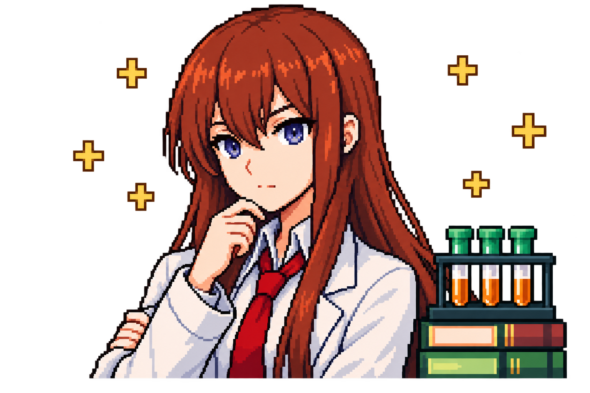

# Amadeus 像素终端界面

项目在 v0.6.2 更名为 Amadeus，[GitHub 仓库](https://github.com/zhengye123188/amadeus)和 npm 包 `@lelouch_021015/amadeus` 使用新名称，启动命令仍为 `research`。现有 API 配置、`RESEARCH_*` 环境变量和项目数据目录保持兼容。

像素界面沿用选定的墨绿概念：薄荷绿标题、琥珀色提示、牧濑红莉栖像素形象、项目与模型信息、工具输出、输入框和状态栏。科研对话、工具、权限、记忆和多 Agent 仍由原运行时处理。

npm 和四平台独立安装器使用同一份界面资源。v0.6.2 将原来的头部特写替换为重新绘制的半身实验室场景，保留托腮、白大褂、红领带、试管架、书本与金色像素十字。发布状态见 [v0.6.2 版本说明](releases/v0.6.2.md)，更新方式见 [分发说明](pypi.md)；发布前已安装的 v0.6.1 仍使用旧特写。安装后用 `research --version` 核对。运行已安装版本：

```bash
research
research --workspace "/你的项目目录"
```

在源码目录开发和预览：

```bash
npm ci
npm start
npm start -- --workspace "/你的项目目录"
```

源码运行需要现有 API 配置或 `npm start -- configure`，以及 `npm start -- setup` / `uv sync --frozen --all-extras` 安装后端。

## 半身场景与终端尺寸（v0.6.2）

新版按用户选定的半身概念重新绘制素材，使用完整场景生成 32×20、48×32、64×40 三份终端网格，不再裁剪为头部特写。眼睛、托腮的手、衣领与领带共同构成形象；试管架、书本与像素十字保留在人物旁。三份网格直接从源 PNG 独立生成，运行时按窗口大小选择，不将小网格继续缩放。



[查看三种实际终端网格](assets/kurisu-halfbody-grids.png)。上图是透明 PNG 原始素材，不是终端截图；[生成记录](assets/kurisu-lab-halfbody-v2.prompt.md) 保留了参考构图和提示词。终端使用 ANSI 半块字符，每个字符显示两个纵向像素。实际字符图只包含对应尺寸的有限像素，不会达到大 PNG 预览的分辨率；窗口大小、等宽字体的字宽与行高以及真彩色支持都会影响效果。v0.6.1 特写的历史变化见其[版本说明](releases/v0.6.1.md)。

| 终端窗口 | 使用的完整半身场景 | 场景所占字符行数 |
| --- | --- | --- |
| 至少 80 列、24 行 | 32×20 | 10 行 |
| 至少 110 列、36 行 | 48×32 | 16 行 |
| 至少 140 列、44 行 | 64×40 | 20 行 |
| 少于 80 列，或少于 24 行 | 隐藏场景，收紧布局 | — |

例如 135 列、37 行窗口使用 48×32 场景。含边框的头部最多占一半窗口行数，保留对话和输入空间；宽而矮的终端使用能满足行数预算的尺寸。

## 外观开关

```bash
research --ui-avatar off
research --ui-theme system
RESEARCH_UI_AVATAR=off research
NO_COLOR=1 research
```

| 设置 | 行为 |
| --- | --- |
| `--ui-avatar pixel` / `RESEARCH_UI_AVATAR=pixel` | 默认；显示彩色半块字符半身场景 |
| `--ui-avatar off` / `RESEARCH_UI_AVATAR=off` | 隐藏头像，保留项目界面 |
| `--ui-theme pixel` / `RESEARCH_UI_THEME=pixel` | 默认；墨绿、薄荷绿和琥珀色 |
| `--ui-theme system` / `RESEARCH_UI_THEME=system` | 使用启动时 Pi 配置的原主题配色 |
| `NO_COLOR` 或 `TERM=dumb` | 单色项目组件，自动隐藏彩色头像 |

命令行设置优先于环境变量，`NO_COLOR` 或 `TERM=dumb` 优先使用单色主题。源码运行可将 `research` 替换为 `npm start --`。进入会话后可用 `/ui avatar pixel`、`/ui avatar off`、`/ui theme pixel`、`/ui theme system` 切换，`/ui` 查看当前设置。头像开关保留在当前进程，包括 `/new` 或 `/reload`，不写入用户配置；主题切换使用 Pi 的主题偏好机制，保存在本项目独立的 Pi 配置目录。启动默认使用像素主题，`--ui-theme system` 可使用原主题配色。在 `/settings` 的 Theme 选项中也可选择上游主题。

满足窗口要求时，半身场景显示在头部右侧；小于 60 列或 24 行时收紧头部。形象使用字符块，因此在普通 macOS/Linux 终端也可显示，不需要 Kitty 或 iTerm 图片协议。程序只绘制自身组件背景；终端空白区域的底色由终端设置决定。推荐支持 Unicode 的等宽字体和深色终端主题。

上下文占用未知时显示 `ctx ?`，尚未选择模型时显示 `/model`。权限、执行、记忆和子 Agent 状态来自核心扩展，Git 分支来自实际工作区。费用请看 `/usage`；状态栏不将未知费用显示为零。

## 输入与会话

输入框继承 Pi 的 `CustomEditor`，保留中文输入、粘贴、多行编辑、历史、命令补全和应用快捷键。底部默认提示 Enter 发送、`/` 命令和 Ctrl+D 退出；自定义快捷键请以当前键位设置为准。运行中取消、审批对话、`/model`、`/new`、`/tree`、`--continue`、`--resume` 和 `--fork` 使用原会话机制。

交互启动由 `bin/interactive.mjs` 通过公开 SDK 实现，默认欢迎页不再显示 Pi 标题；上游少数内置帮助、更新日志和退出提示仍可能使用 Pi 名称。可通过 `research --continue` 或 `research --session 会话文件` 恢复本项目会话。`-p`、JSON、RPC 和工具型命令继续由 Pi CLI 处理，输出不添加界面装饰。

## 修改代码

| 文件 | 修改内容 |
| --- | --- |
| `pi/ui.ts` | 组件背景、布局、标题、状态栏、输入框边框、`/ui` 命令 |
| `pi/assets/kurisu-pixel.png` | 随包透明半身场景，与选定的重绘素材一致 |
| `pi/assets/kurisu-pixel.json` | schema 3 的三份终端调色板网格及来源记录；运行时直接读取 |
| `pi/themes/research-pixel.json`、`pi/themes/research-mono.json` | 显式加载的主题资源，保证新建或重载会话后配色一致 |
| `scripts/prepare-pixel-avatar.mjs` | 将完整 PNG 场景直接转为三份终端网格，不改原图 |
| `bin/interactive.mjs` | 公开 SDK 启动、静默欢迎页、窗口标题和会话选择 |
| `scripts/smoke_ui.py` | 真实伪终端启动、缩放、中文输入、选择器和退出验证 |

替换素材后重新运行 `node scripts/prepare-pixel-avatar.mjs`，并核对三种尺寸下的完整构图与透明边缘。脚本以完整场景生成网格，不再使用旧版头部裁剪范围；JSON 记录源图哈希与采样信息。PNG 和 JSON 都属于 npm 的 `pi` 目录，独立安装器从同一个 npm 打包内容构建。[选定的源素材](assets/kurisu-lab-halfbody-v2.png)与[生成记录](assets/kurisu-lab-halfbody-v2.prompt.md)留在文档中供审查。

随包头像为本项目基于选定概念生成的插画，角色来自《命运石之门》。角色相关权利属于各自权利人，本项目无官方关联；代码的 MIT 许可不授予底层角色权利。来源说明见 [第三方许可](../THIRD_PARTY_NOTICES.md)。

不要修改 `node_modules`：重新安装会覆盖修改，也无法通过正常依赖打包分发。不要接管编辑器按键或删掉光标控制标记；只在组件边界处理样式与布局。终端标题、路径和状态中的控制字符会被清理，宽度按实际显示列计算。
