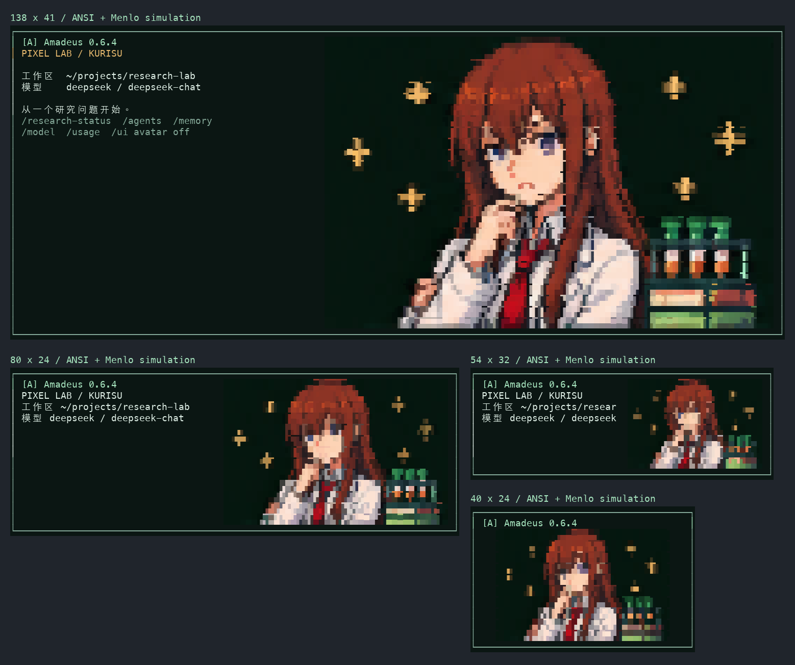
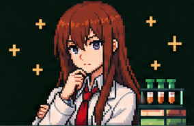

# Amadeus 像素终端界面

项目在 v0.6.2 更名为 Amadeus，[GitHub 仓库](https://github.com/zhengye123188/amadeus)和 npm 包 `@lelouch_021015/amadeus` 使用新名称，启动命令仍为 `research`。现有 API 配置、`RESEARCH_*` 环境变量和项目数据目录保持兼容。

像素界面沿用选定的墨绿概念：薄荷绿标题、琥珀色提示、牧濑红莉栖像素形象、项目与模型信息、工具输出、输入框和状态栏。科研对话、工具、权限、记忆和多 Agent 仍由原运行时处理。

npm 和四平台独立安装器使用同一份界面资源。本文描述 v0.6.4 的概念图像素提取与字符渲染；v0.6.2 及更早版本仍使用旧头像。发布状态见 [v0.6.4 版本说明](releases/v0.6.4.md)，更新方式见 [分发说明](pypi.md)。安装后用 `research --version` 核对。运行已安装版本：

```bash
research
research --workspace "/你的项目目录"
```

在源码目录开发和预览：

```bash
npm ci
npm start
npm start -- --workspace "/你的项目目录"
```

源码运行需要现有 API 配置或 `npm start -- configure`，以及 `npm start -- setup` / `uv sync --frozen --all-extras` 安装后端。

## 不同窗口尺寸示例



此图使用程序实际输出的 ANSI 颜色和四分块字符，经终端模拟器解析后以 macOS Menlo 字体绘制；工作区与模型为示例。它展示 138×41、80×24、54×32 和 40×24 的头部，是字符模拟图，不是真实终端 GUI 截图。138×41 的人物占 80 列、26 行；终端字体、行距与颜色支持仍影响实际效果。

## 直接提取概念图像素

v0.6.3 使用用户提供的 284×184 半身概念图，保留托腮、白大褂、红领带、试管架、书本与金色像素十字，直接提取原图颜色，不重新绘制形象。随包 PNG 与下方参考图字节一致，SHA-256 为 `b452c28928058ddb3d95b030718bd8362f6a8a814ec4fc1920c5cafa74260a62`。



之前反复更换素材仍不清晰，是因为普通窗口内的字符网格远小于源图，且旧版还将颜色限制到 63 种。现在移除这项全图调色板限制，所有存储的 RGB 值来自概念图；十四档完整场景分别从原图独立采样，避免重复缩放。

| 采样网格 | 场景字符列数 | 场景字符行数 |
| --- | --- | --- |
| 16×10 / 24×16 / 32×20 / 40×26 | 16 / 24 / 32 / 40 | 5 / 8 / 10 / 13 |
| 48×32 / 56×36 / 64×42 / 72×46 | 48 / 56 / 64 / 72 | 16 / 18 / 21 / 23 |
| 80×52 / 88×58 / 96×62 / 112×72 | 80 / 88 / 96 / 112 | 26 / 29 / 31 / 36 |
| 144×94 / 284×184 原尺寸 | 144 / 284 | 47 / 92 |

程序选择能容纳的最大档。宽窗口为文字留至少 40 列，中、小窗口留 28 或 20 列；无法并排时，将场景放在标题下方。头部含边框最多占窗口行数的 70%，并至少留出 7 行给输入和状态。135×37 使用 72×46，138×41 使用 80×52，80×24 使用 40×26，54×32 使用 24×16，40×24 使用上下布局的 32×20。窗口极小、连最小完整场景都无法放下时会显示“窗口过小”；单色或显式关闭头像时仍不显示彩色场景。

同时监听原始 SIGWINCH 信号与尺寸事件，覆盖内核合并快速缩放信号的情况。缩放结束 120 毫秒后，通过公开 TUI API 失效缓存并强制重绘。即使快速缩小再恢复原尺寸，也会清理旧画面的重排残留；切换头像、重载和退出会移除旧监听与待执行任务。相邻字符复用 ANSI 颜色状态，每行末尾统一重置，减少重绘数据量。

四分块采样参考每个子像素覆盖区域，兼顾中心像素的轮廓，最终回取原图中真实存在的 RGB；没有在运行时解码图片。低分辨率档将 RGB 各通道差异不超过 3 的近似平坦区域合并，减少背景噪点；原尺寸档不作这种合并，半块模式继续使用直接采样。缩小后的细节与颜色仍是近似。

默认 `pixel` 用 `▘`、`▝`、`▚` 等四分块字符，每个字符表示 2×2 子像素；72×46 网格对应 144×46 的子像素采样。ANSI 每个字符只能设置一个前景色和一个背景色，因此每组四个子像素仍需选择两种原图颜色近似。`half` 用 `▀` 表示上下两个采样像素，减少对四分块字形的依赖。这两种模式都不发送 PNG 图片协议。

小窗口无法保留 284×184 原图的全部细节；四分块也不是无损图片显示。在例如 340×135 的大窗口中，`half` 可使用 284×184 原尺寸网格，逐像素保留源图 RGB。原始图像只是源素材，实际清晰度还取决于终端字体字宽、行高及真彩色支持。v0.6.2 的[旧字符布局预览](assets/amadeus-header-preview.png)、[重绘素材](assets/kurisu-lab-halfbody-v2.png)和[生成记录](assets/kurisu-lab-halfbody-v2.prompt.md)作为历史记录保留。

## 外观开关

```bash
research --ui-avatar off
research --ui-avatar half
research --ui-theme system
RESEARCH_UI_AVATAR=off research
NO_COLOR=1 research
```

| 设置 | 行为 |
| --- | --- |
| `--ui-avatar pixel` / `RESEARCH_UI_AVATAR=pixel` | 默认；显示彩色四分块字符半身场景 |
| `--ui-avatar half` / `RESEARCH_UI_AVATAR=half` | 半块字符；适合四分块字形有接缝的字体 |
| `--ui-avatar off` / `RESEARCH_UI_AVATAR=off` | 隐藏头像，保留项目界面 |
| `--ui-theme pixel` / `RESEARCH_UI_THEME=pixel` | 默认；墨绿、薄荷绿和琥珀色 |
| `--ui-theme system` / `RESEARCH_UI_THEME=system` | 使用启动时 Pi 配置的原主题配色 |
| `NO_COLOR` 或 `TERM=dumb` | 单色项目组件，自动隐藏彩色头像 |

命令行设置优先于环境变量，`NO_COLOR` 或 `TERM=dumb` 优先使用单色主题。源码运行可将 `research` 替换为 `npm start --`。进入会话后可用 `/ui avatar pixel`、`/ui avatar half`、`/ui avatar off`、`/ui theme pixel`、`/ui theme system` 切换，`/ui` 查看当前设置。头像开关保留在当前进程，包括 `/new` 或 `/reload`，不写入用户配置；主题切换使用 Pi 的主题偏好机制，保存在本项目独立的 Pi 配置目录。启动默认使用像素主题，`--ui-theme system` 可使用原主题配色。在 `/settings` 的 Theme 选项中也可选择上游主题。

半身场景通常显示在头部右侧，窄窗口可显示在标题下方；小于 100 列或 28 行时收紧文字。形象使用字符块，因此在普通 macOS/Linux 终端也可显示，不需要 Kitty 或 iTerm 图片协议。程序只绘制自身组件背景；终端空白区域的底色由终端设置决定。推荐支持 Unicode 的等宽字体和深色终端主题。

上下文占用未知时显示 `ctx ?`，尚未选择模型时显示 `/model`。权限、执行、记忆和子 Agent 状态来自核心扩展，Git 分支来自实际工作区。费用请看 `/usage`；状态栏不将未知费用显示为零。

## 输入与会话

输入框继承 Pi 的 `CustomEditor`，保留中文输入、粘贴、多行编辑、历史、命令补全和应用快捷键。底部默认提示 Enter 发送、`/` 命令和 Ctrl+D 退出；自定义快捷键请以当前键位设置为准。运行中取消、审批对话、`/model`、`/new`、`/tree`、`--continue`、`--resume` 和 `--fork` 使用原会话机制。

交互启动由 `bin/interactive.mjs` 通过公开 SDK 实现，默认欢迎页不再显示 Pi 标题；上游少数内置帮助、更新日志和退出提示仍可能使用 Pi 名称。可通过 `research --continue` 或 `research --session 会话文件` 恢复本项目会话。`-p`、JSON、RPC 和工具型命令继续由 Pi CLI 处理，输出不添加界面装饰。

## 修改代码

| 文件 | 修改内容 |
| --- | --- |
| `pi/resize.ts` | 缩放结束后的强制重绘与监听清理 |
| `pi/ui.ts` | 组件背景、布局、标题、状态栏、输入框边框、`/ui` 命令 |
| `pi/assets/kurisu-pixel.png` | 随包 284×184 半身概念图，与用户选定的参考图字节一致 |
| `pi/assets/kurisu-pixel.json` | schema 5 的十四档原图颜色采样、四分块表及来源记录；运行时直接读取 |
| `pi/themes/research-pixel.json`、`pi/themes/research-mono.json` | 显式加载的主题资源，保证新建或重载会话后配色一致 |
| `scripts/prepare-pixel-avatar.mjs` | 将完整 PNG 场景直接转为十四档终端网格，不改原图 |
| `bin/interactive.mjs` | 公开 SDK 启动、静默欢迎页、窗口标题和会话选择 |
| `scripts/smoke_ui.py` | 真实伪终端启动、缩放、中文输入、选择器和退出验证 |

替换素材后重新运行 `node scripts/prepare-pixel-avatar.mjs`，并核对各档尺寸的完整构图和颜色。脚本使用完整场景，JSON 记录源图哈希、尺寸、全图范围与采样方法；四分块表另外记录每个字符的两个颜色索引。PNG 和 JSON 都属于 npm 的 `pi` 目录，独立安装器从同一个 npm 打包内容构建。[选定的概念素材](assets/kurisu-concept-reference.png)留在文档中供审查。

随包头像来自用户选定的概念图，角色来自《命运石之门》。角色相关权利属于各自权利人，本项目无官方关联；代码的 MIT 许可不授予底层角色权利。来源说明见 [第三方许可](../THIRD_PARTY_NOTICES.md)。

不要修改 `node_modules`：重新安装会覆盖修改，也无法通过正常依赖打包分发。不要接管编辑器按键或删掉光标控制标记；只在组件边界处理样式与布局。终端标题、路径和状态中的控制字符会被清理，宽度按实际显示列计算。
