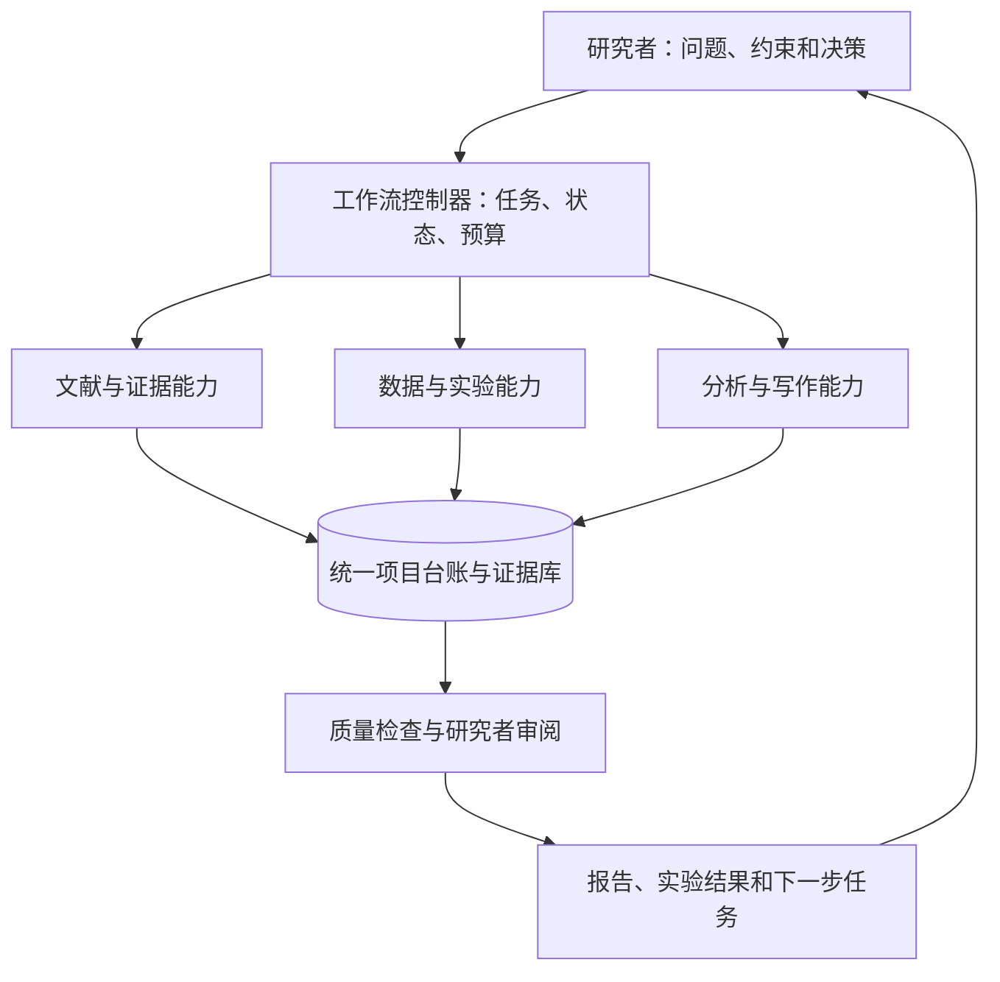

# 自动化科研 Agent：调研与建设方案

> 历史调研稿：其中固定工作流式产品架构已被用户修正。当前目标是可交互、由模型动态选择工具的 CLI 科研 Agent，用于面试展示并发布 GitHub。产品规格以同目录《CLI科研Agent项目规格.md》为准；本文保留科研能力与证据管理方面的调研背景。

调研日期：2026-09-29。适用假设：个人或小团队，先建立文献与计算科研工作流，由研究者负责关键科学判断；湿实验作为后续分支。

本报告基于代表性研究论文、项目官方仓库、技术官方文档和当前会话提供的技能目录。它是建设前的案头调研，并非穷尽式系统综述或产品实测。下文功能优先级、工期、指标和架构均为建议，不是已实现能力或供应商承诺。

**建议先实现一个有明确输入、可检查产物、能恢复运行的科研工作流，再逐步增加自主性。** 第一版以“研究问题 → 文献与证据 → 对比分析 → 待验证假设 → 研究者决策”为闭环；第二版加入“数据 → 代码 → 实验 → 统计 → 结果”；第三版才考虑跨轮次自动探索和实验设备。

**1．现有系统已经做到什么，可以借鉴什么**

| 代表系统或研究 | 已公开展示的能力 | 对本项目的启发与适用边界 |
|---|---|---|
| Sakana AI Scientist-v2，2025 | 自动提出想法、编写并运行实验、分析和撰写稿件；论文报告了三篇自动生成稿件的 workshop 评审实验 | 借鉴实验树和实验管理器；证据来自特定机器学习研究场景，不能据此推断所有学科都能无人完成。[论文](https://arxiv.org/abs/2504.08066)、[官方代码](https://github.com/SakanaAI/AI-Scientist-v2) |
| Google Co-Scientist，2026 年 5 月官方更新 | 围绕研究者给定目标，迭代生成、讨论、改进和比较假设 | 假设生成和验证必须分开；模型排序可以辅助筛选，科学有效性仍需外部证据。[官方介绍](https://deepmind.google/blog/co-scientist-a-multi-agent-ai-partner-to-accelerate-research/) |
| FutureHouse Robin，Nature，2026 年 5 月 | 将文献检索、假设生成、实验数据分析和下一轮假设连接起来；研究人员审核候选方案并执行实验 | 借鉴“agent 分析—人员实验—数据反馈”的闭环；论文中的物理实验不是全部由软件自动执行。[论文与方法](https://www.nature.com/articles/s41586-026-10652-y) |
| Co-Scientist 扩展研究，2026 年 8 月预印本 | 作者报告材料、生物和计算科研中的执行与实验反馈；材料结果中仍有结构需要进一步确认 | 可借鉴受实验室条件约束的规划；本次核对了摘要，属于预印本证据，不能当成普遍成熟能力。[预印本摘要](https://arxiv.org/abs/2608.26701) |
| OpenAI Rosalind Workbench，2026 年 8 月官方介绍 | 面向生命科学的引导式任务、科学查看器和测序分析工作流，把计划、工具与证据放在同一环境 | 可借鉴项目工作台和证据查看方式；当时处于 research preview，高级研究访问有资格条件，本次未验证账户可用性。[官方介绍](https://developers.openai.com/blog/rosalind-workbench) |
| PaperBench，2025 | 将论文复现拆成可单独评分的任务，由论文作者参与制定评估规则 | 借鉴“先定义怎样才算完成，再让 agent 执行”的验收方式；历史模型分数不用于推断今日系统表现。[论文](https://arxiv.org/abs/2504.01848) |

综合这些来源，我的工程判断是：当前最值得建设的是有边界、能核验、能积累证据的科研助手。自动生成一篇长文可以是输出之一，但不是衡量科研自动化是否成功的充分条件。

**2．需要实现的功能及优先级**

P0 表示首版必需；P1 表示首版稳定后增加；P2 表示有明确需求和验证基础后扩展。若你的主要工作是计算科研，可将数据接入和实验执行提前到 P0。

| 模块 | 需要完成的工作 | 必须交付的产物 | 优先级 |
|---|---|---|---|
| 研究立项 | 明确问题、研究对象、边界、现有基础、可用数据、时间和预算 | 项目说明、成功标准、排除项 | P0 |
| 文献发现与跟踪 | 关键词与同义词检索、引文追踪、多源去重、增量更新、筛选理由 | 可重放检索式、检索日期、文献清单、排除记录 | P0 |
| 全文获取与解析 | 通过开放获取或已授权渠道取得全文，解析正文、图表、补充材料 | 原始文件、结构化文本、页码或段落定位、获取状态 | P0 |
| 证据与知识库 | 将结论关联原文或实验，保留相反证据、适用条件、版本和不确定性 | 证据卡、论断—证据表、来源索引 | P0 |
| 文献综合 | 比较方法、样本、数据、指标、结论和局限，识别争议与候选空白 | 对比矩阵、带来源的专题报告 | P0 |
| 假设与实验设计 | 给出可证伪假设、替代解释、对照、评价指标、资源需求和停止规则 | 假设卡、实验计划、研究者决策记录 | P1 |
| 数据接入与质量检查 | 检查字段、单位、缺失值、重复、批次、样本身份及数据划分 | 数据字典、数据版本、质量报告 | P1 |
| 编程与实验执行 | 复现基线、生成代码、执行仿真或分析、处理失败、限制资源 | 代码版本、运行环境、参数、日志、实验结果 | P1 |
| 统计分析与绘图 | 估计效应和不确定性、核对统计设计、生成可复现图表 | 分析脚本、统计结果表、图和源数据 | P1 |
| 写作与交付 | 按已核验结果撰写正文、核对引文、生成补充材料和汇报 | 带证据映射的稿件、参考文献、图表与复现包 | P1 |
| 项目和实验记录 | 维护任务、依赖、版本、失败结果、决策和待解决问题 | 任务看板、实验台账、决策日志 | P0 |
| 运行管理 | 持久化状态、恢复任务、预算限制、权限控制、日志、通知与评测 | 运行记录、质量报告、成本统计、恢复记录 | P0 |
| 仪器及实验室集成 | 对接样本、库存、预约、设备状态和实验数据回传 | 电子实验记录、设备适配器、校准与执行记录 | P2，按实验室单独设计 |

文献模块应默认跨期刊搜索，用主题相关性、方法可靠性和证据直接程度排序。目标期刊格式与全文获取权限是另外两个问题。期刊名、引用量和模型打分都不宜单独代表研究质量。

**3．第一版应该跑通的完整任务**

给系统一个真实课题、一组种子论文以及纳入／排除标准，完成下面这一轮：

1. 将问题转成检索策略，保存版本和检索日期。
2. 获取候选记录，按 DOI、数据库 ID 和题名等信息去重；保留预印本与正式版本之间的关系。
3. 筛选论文，记录纳入和排除理由；优先读取最相关的全文。
4. 提取研究问题、方法、数据、结果、限制，以及可核对的原文位置。
5. 生成文献对比矩阵，分别呈现共识、冲突、证据不足和后续检索需求。
6. 给出少量可测试的研究问题，每项说明已知依据、反对证据、还缺什么验证。
7. 自动检查引文存在性和产物完整性，由研究者抽查内容支持关系。
8. 保存成果、过程和待办；下次仅处理新增或变化的信息。

建议用 20–50 篇已知相关文献进行首轮验证，规模按领域调整。这是工程试点集，不代表系统综述已经达到充分覆盖。

完成标准是：另一位研究者可以沿着报告回到证据，并理解为何纳入文献、如何形成结论、哪些地方仍不确定。只有摘要的论文必须标注“摘要级”，不能生成仿佛读过全文的实验细节。

**4．如何组织系统**

建议把系统划分为五层：

| 层次 | 职责 | 首版原则 |
|---|---|---|
| 工作入口 | 输入课题、补充材料、查看结果和作出决策 | 使用一个主入口和一个项目看板，减少状态分散 |
| 工作流控制器 | 拆解任务、满足依赖后调度、检查预算、持久化状态 | 控制关键状态转换，限制循环次数 |
| 科研能力模块 | 检索、精读、分析、编码、写作、审查 | 输入、输出和错误类型有统一约定 |
| 工具执行层 | 数据库 API、文献库、文件、代码沙箱、计算集群 | 参数校验、限时、限额、幂等、防重复提交 |
| 数据与评测层 | 存储证据、运行记录、产物、版本和评价结果 | 所有结果可以关联项目、任务和来源 |

**能力角色与独立 agent 进程应分开设计。** 首版可以由一个控制器按步骤调用多个技能；检索与独立审查确有并行价值时再拆成多个执行者。增加 agent 数量前，先比较质量提升能否覆盖成本、延迟和沟通开销。多个模型赞同同一结论，也不能替代实验验证。

**5．如何管理项目、任务与科学结论**

建议采用“项目 → 研究问题／假设 → 工作包 → 任务 → 运行 → 产物”的层级。任务回答“要完成什么”，运行记录回答“这次具体怎么做、做成什么”。一次任务重试会产生新的运行记录，不能覆盖旧结果。

每张任务卡至少保存：任务 ID、项目 ID、目标、负责人、输入版本、依赖、预期产物、验收标准、截止时间、预算上限、当前状态、失败原因、最后运行 ID 和产物位置。

任务状态采用：

`待办 → 就绪 → 执行中 → 待验收 → 已完成`

同时支持 `等待人工输入`、`受外部依赖阻塞`、`失败待处理`、`已取消`。重试应有次数上限；预算不足、缺少原文和科研结果不理想应分别记录，不能统一归类为“失败”。

科学结论另设状态，例如 `待验证假设`、`有初步支持`、`证据冲突`、`在指定条件下得到支持`、`被否定`。一个实验任务正常完成，完全可以得到否定假设的结果。

| 管理对象 | 建议保存的信息 | 解决的问题 |
|---|---|---|
| 文献 Source | DOI／URL、版本、来源数据库、获取日期、全文可用性、文件哈希、授权信息 | 找得到原文和使用的具体版本 |
| 证据 Evidence | 原文摘录或结果引用、页码／图表／段落、支持关系、条件、提取方式、审核状态 | 核对“这条来源是否支持这句话” |
| 假设 Hypothesis | 预测、机制解释、替代解释、支持与反对证据、可证伪条件 | 避免把猜测当作已知事实 |
| 数据 Dataset | 来源、内容哈希、字段、单位、样本信息、处理步骤、数据划分 | 避免数据串用、泄漏和版本混乱 |
| 实验 Experiment | 方案版本、代码提交、环境、随机种子、参数、资源、完整运行结果 | 可重跑、可比较、保留负结果 |
| 产物 Artifact | 文件位置、版本、哈希、对应任务及运行、生成依赖 | 从图表和稿件追溯到源数据 |
| 决策 Decision | 问题、可选方案、选择理由、证据 ID、决策者和时间 | 解释研究方向为何改变 |

最关键的关联是：`稿件论断 → 证据 ID → 文献位置或实验运行 → 原始数据与代码版本`。先用关系表实现这些关联，规模和查询需求明确后再考虑专门的知识图谱。

**6．如何让自动化长期运行**

| 情况 | 建议处理方式 |
|---|---|
| API 暂时失败或限流 | 有上限的重试、退避和缓存；必要时切换来源并标注覆盖变化 |
| 程序退出或机器重启 | 从已持久化的检查点恢复；核查外部任务状态后继续 |
| 同一个触发重复到达 | 用任务唯一键和输入版本识别重复，不重复归档或提交实验 |
| 写入或实验提交后连接中断 | 查询外部执行记录，确认是否已执行，不能直接再做一遍 |
| 代码不能运行 | 记录错误与有限次修复；达到上限后留下可诊断产物 |
| 原文不可获取 | 保留元数据和缺口标记，降级到摘要级结论 |
| 超出预算或时间 | 保存当前进度并暂停后续开销，展示已完成部分和继续条件 |
| 上游数据或方案变化 | 标记受影响的下游结论和产物，按依赖重新验证 |
| 需要研究者决定 | 显示具体方案、证据和影响，等待一次明确选择 |

LangGraph 的持久化机制支持保存任务状态及跨任务数据，interrupt 支持等待人工输入；恢复时节点中的部分代码可能重新执行，所以检查点仍需结合工具幂等设计。[持久化文档](https://docs.langchain.com/oss/python/langgraph/persistence)、[中断与恢复文档](https://docs.langchain.com/oss/python/langgraph/interrupts)

建议按动作配置权限：在已授权项目内的检索、草稿和限额分析可以连续执行；实验方案重大变更、额外高成本计算、对外发送或发表、真实仪器操作则依据明确的授权规则执行。规则由控制器和工具层落实，不只写在提示词里。

论文、网页和代码仓库内容应作为待分析材料，不能修改系统权限、预算或任务目标。执行环境限制网络、文件路径和资源，密钥由执行服务管理。敏感研究数据是否可以发送给模型服务，应按项目的数据边界配置；日志同样需要控制内容与访问权限。

**7．怎样评估它是否真的有用**

评测分三层：程序检查格式和运行结果，领域专家检查证据及方法，真实项目比较时间与质量。LLM 审查适合发现线索，不能独立承担所有验收。

| 指标 | 测量方法 | 建议首版验收标准 |
|---|---|---|
| 来源可追溯性 | 检查交付结果中每条核心论断是否有可访问定位 | 核心论断全部有证据定位；访问受限项有明确标记 |
| 引文真实性 | 核对题名、作者、年份、DOI 或其他稳定标识 | 验收样本中零虚构文献；没有 DOI 不自动判错 |
| 证据支持关系 | 专家判断原文是否直接支持论断及适用范围 | 先以抽检 ≥95% 正确为试点目标；关键错误逐项修复 |
| 检索质量 | 在人工标注文献集上计算查准率和召回率 | 记录基线及改善；不能拿已知集合召回率冒充全领域召回率 |
| 数据和数值正确性 | 与人工参考结果或已核验脚本比较 | 主指标及关键统计量在预先规定的容差内一致 |
| 实验可复现性 | 从固定输入、环境和参数重新运行 | 试点主结果均可重跑；随机结果用预先规定的分布／误差标准 |
| 故障恢复 | 注入断网、进程退出、重复触发等情况 | 约定故障用例全部通过，无重复外部动作或产物遗失 |
| 有效产出成本 | 总模型、工具、计算成本 ÷ 验收通过任务数 | 连同研究者审阅时间一起报告，试运行后设预算 |
| 人工时间节省 | 对同类真实任务记录全流程耗时 | 比较“人工完成”和“agent 加审核返工”的总时间 |

这些百分比是待校准的工程目标，不是现有系统已达到的成绩。验收样本通过也不能证明今后永不出错。

建议先收集约 30–50 个小任务作为初始评测集，覆盖正常输入、证据不足、相互矛盾、缺少全文、表格解析错误、代码失败和重复触发。将调试集与保留评测集分开，升级模型、提示词、技能或解析器后运行回归评测。

OpenAI 的 agent 文档也将运行轨迹与持续评测分开：先检查模型与工具实际执行了什么，再用固定数据集和评价规则比较修改效果。运行日志记录输入、输出、调用和决策依据即可，不依赖模型提供内部思维过程。[可观测性](https://developers.openai.com/api/docs/guides/agents/integrations-observability)、[工作流评测](https://developers.openai.com/api/docs/guides/agent-evals)

科研层面的控制还包括：实验前固定主要指标、对照和停止规则；区分探索性与验证性分析；保留失败运行；防止测试集参与调参；样本量、统计单位和多重比较由适合该领域的方法处理。这些应进入任务验收条件。

**8．建议采用的工具组合**

下面是适合原型的候选组合。具体版本、接入权限和部署方式需在开工时确认，本轮未安装或运行这些组件。

| 需求 | 建议起点 | 选择理由及何时扩展 |
|---|---|---|
| 工作流编排 | Python + LangGraph | 适合明确状态、分支和人工决策的流程；用持久化后端保存运行。[官方文档](https://docs.langchain.com/oss/python/langgraph/persistence) |
| 替代编排路线 | OpenAI Agents SDK | 若主要使用 OpenAI 工具生态，可评估其工具接入与 tracing；仍需项目台账和持久化策略。首版选择一条主编排路线。[官方文档](https://developers.openai.com/api/docs/guides/agents/integrations-observability) |
| 项目状态存储 | 单机 SQLite；多人或并发服务再考虑 PostgreSQL | 这是部署建议；数据库保存结构化记录，原始大文件独立保存 |
| 文献发现 | OpenAlex + Crossref，按学科增加专门数据库 | 前者提供研究索引 API，后者提供书目及更新元数据；全文获取单独处理。[OpenAlex](https://help.openalex.org/api/)、[Crossref](https://www.crossref.org/documentation/retrieve-metadata/rest-api/) |
| 文献库 | Zotero | 通过官方 API 管理条目和相关资源；首次接入先验证读写范围。[API 文档](https://www.zotero.org/support/dev/web_api/v3/) |
| PDF 结构解析 | GROBID，图表及扫描件另做识别与人工抽检 | 官方支持正文、参考文献、引文上下文及坐标提取；复杂公式和表格仍应验收。[官方文档](https://grobid.readthedocs.io/en/latest/Introduction/) |
| 代码与实验环境 | Git + 固定依赖环境 + 受限容器／计算任务 | 提议将 agent 开发环境与科研代码执行环境分开，按项目限制资源 |
| 数据和流水线版本 | 计算科研阶段引入 DVC | 用版本化的依赖和阶段描述组织可复现的数据流水线。[官方文档](https://doc.dvc.org/user-guide/pipelines) |
| 实验比较 | 运行规模增加后引入 MLflow | 记录参数、代码版本、指标和产物，并按实验分组比较。[官方文档](https://mlflow.org/docs/latest/ml/tracking/) |
| 知识检索 | 先用结构化字段和全文检索；有实测收益再加向量检索 | 向量索引用于找材料，事实和证据定位仍以原始记录为准 |
| 通知和任务界面 | 选择一个已有工作入口，另提供可查询的任务记录 | 通知只报告完成、失败、重要变化和待决策事项；看板不成为唯一数据存储 |

原型可在本机开发；需要不间断定时运行时，将调度、数据库和执行器放在持续在线的环境。长时间计算由任务执行器提交并跟踪，控制器可以退出后恢复。定时器只负责触发，不承担全部科研流程状态。

成本应按 `模型调用 + 检索／工具服务 + CPU/GPU + 存储 + 人工审核` 统计。先用一批真实任务测量，再确定每任务、每天和每项目的开销上限。记录检索量、解析页数、token、运行时间和重试次数，才能判断费用来自哪里。模型选择以本项目评测结果为依据。

**9．你现有技能可以怎样复用**

以下映射根据当前会话的技能目录；本轮仅阅读了 OpenAI Docs 与 nature-literature-pipeline 的技能正文，没有逐个运行其他技能，也没有证明其外部服务已经接通。

| 工作包 | 可评估复用的现有技能 | 集成前要补的验证 |
|---|---|---|
| 文献发现与增量整理 | nature-academic-search、nature-literature-pipeline、nature-downloader | 数据源权限、去重、失败降级、查询记录 |
| 精读与知识沉淀 | nature-reader、nature-experiment-log | 来源定位、图表完整性、样本／实验身份关联 |
| 引文和证据核对 | nature-citation、nature-ref-verifier | 书目信息正确性与论断支持关系分别验收；检索范围按课题配置 |
| 统计与科研图表 | nature-statistics、nature-figure | 数据可追溯、统计设计、重跑一致性 |
| 写作和修订 | nature-writing、nature-polishing、nature-reviewer、nature-response | 只使用允许的证据；审稿模拟不能代替外部验证 |
| 交付和共享 | nature-paper2ppt、nature-data 等 | 数字、图表、参考文献与最终核验版本一致 |

已读取的 [nature-literature-pipeline 技能](/Users/zy/.codex/skills/nature-literature-pipeline/SKILL.md) 提供“检索—评分—精读—交付—归档”的流程，并区分全文、摘要和元数据级来源。可借鉴其结构；评分权重、通知目标和归档位置需要按本项目重设。技能存在并不等于长期服务、外部连接和恢复机制已经就绪。

**10．建设顺序、任务和阶段验收**

以下为熟悉 Python／API 的一名开发者，加领域研究者持续参与的粗略估算；假设数据和接口权限已具备，不包含模型训练、设备采购和复杂仪器联调。阶段可以部分重叠，具体排期应根据试点调整。

| 阶段 | 建设任务 | 交付物 | 进入下一阶段的条件 | 粗略工作量 |
|---|---|---|---|---|
| A：定义试点 | 选一个课题，明确输入、标准、权限和预算；整理人工参考材料 | 项目说明、验收样例、数据清单 | 能客观判断一个任务是否成功 | 1–3 个工作日 |
| B：文献与证据闭环 | 接检索源、去重、获取解析、证据卡、生成报告、保存运行记录 | 一个能完整跑通的真实课题 | 来源可追溯，抽检通过，失败能说明 | 1–2 周 |
| C：可靠运行 | 完善恢复、限流、幂等、预算、看板、日志、回归评测及备份 | 可持续运行的科研助手 | 重启、重复触发和接口故障用例通过 | 1–2 周 |
| D：计算实验闭环 | 数据版本、基线、沙箱执行、实验记录、统计绘图、结果复现 | 一个可重跑的实际分析或仿真实验 | 主结果通过领域验收并可复现 | 2–3 周 |
| E：扩展能力 | 增加领域工具、跨轮探索、协作或设备适配 | 按需求确定 | 每项新增能力通过原有回归及新增验收 | 单独估算 |

建议把“文献证据版”作为第一个可用里程碑；如果你以计算实验为主，则缩小文献范围，同时把一个已有分析流水线接进首版。先复现已有可靠结果，再尝试自主探索新方法。

细化建设待办见同目录《科研Agent建设任务清单.md》，所有条目当前均为规划项。

**11．日常怎样管理**

| 频率 | 研究者需要做什么 | 系统需要做什么 |
|---|---|---|
| 每次新项目 | 说明问题、证据要求、资源边界和成功标准 | 建立项目记录、任务依赖与初始计划 |
| 日常 | 处理待决策项，抽查重要产物 | 完成授权任务，更新状态，报告有意义的变化 |
| 每周 | 检查假设是否仍有价值、证据是否冲突、哪些任务应停止 | 汇总已验收成果、负结果、费用、返工和依赖阻塞 |
| 每次模型／技能升级 | 审阅回归结果再扩大使用 | 在保留测试集上比较，记录版本并支持回退 |
| 每月或阶段结束 | 调整研究方向、预算、访问和存储策略 | 检查数据源连接、索引新鲜度、备份恢复和成本趋势 |

一个简洁工作台至少应能看到：项目目标、任务及阻塞、证据及来源、实验比较、待决策事项，以及费用和运行健康情况。关键页面能点击回到证据或日志，避免只显示“已完成”标签。

角色上，研究负责人决定方向与验收，系统维护者负责连接和稳定性，agent 完成授权执行；个人使用时前两者可以是同一个人。更改项目目标、主要实验方案和结论应保留版本与原因。

**12．下一轮设计需要确定的条件**

- 学科和具体课题：文献密集、计算实验或湿实验为主。
- 优先工作流：最耗时且有清晰验收标准的一项重复任务。
- 现有资料：论文库、数据、代码、实验日志及其存放位置。
- 可用资源：API、机构文献访问、算力、持续在线环境和预算。
- 自动化边界：哪些动作已经允许自动执行，哪些科学判断保留研究者决策。

这些条件尚未确定时，推荐从“一个课题、一个统一台账、一个可核验闭环”开始，把试运行中的失败样例转成下一轮建设任务。
